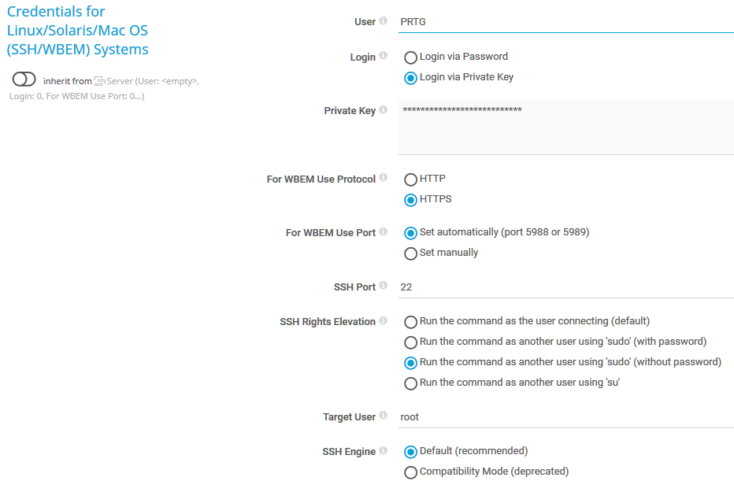
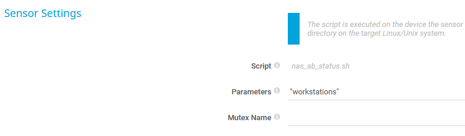
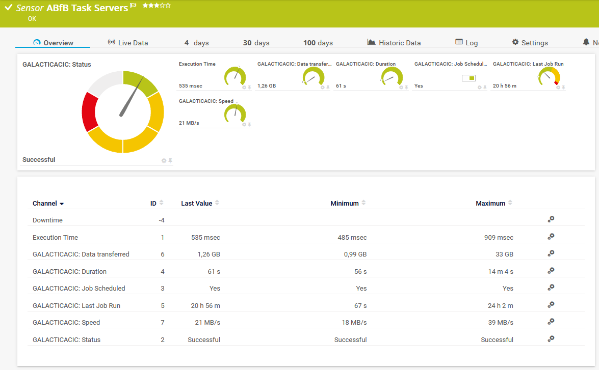
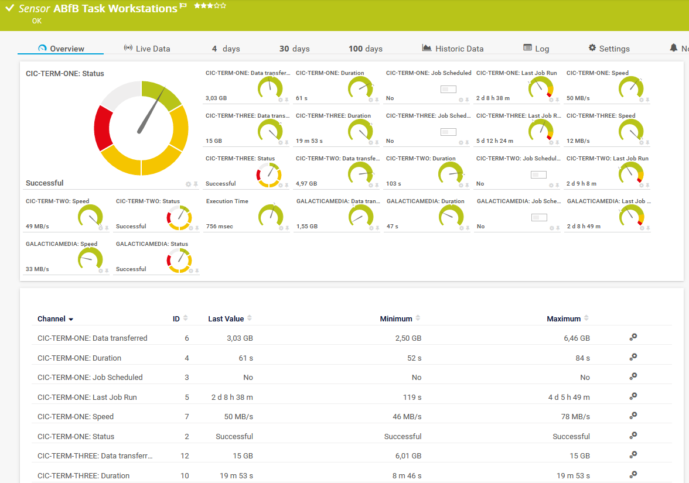

# nas_ab_status
Bash script for PRTG by Paessler to monitoring status of device backup in Synology Active Backup for Business

The sensor will show the status of the last backup, how many data were transferred, the duration and the time passed since the laste backup. nas_ab_status_m.sh is for multiple devices in one sensor.

Sensor has to be created in PRTG on your Synology device.

Sensor tested on DS 918+ with DSM 7.2.1-69057 / Active Backup for Business 2.6.2-23081

Thanks to https://github.com/r2evans I could change the access to the sqlite database to just one query. See also issue https://github.com/WAdama/nas_ab_status/issues/8 .

### Prerequisites

Access to the SQLite database files requires root access so the script has to run with sudo or equivalent rights.

Be sure you have set correct logon values for SSH in your device.

I personally use "Login via private key" with an user especially for monitoring which also may use sudo for this script without a password.



**HINT:** Since DSM 6.2.2 for SSH access the user has to be member of the local Administrators group on your Synology NAS.

### Installing

Place the script to /var/prtg/scriptsxml on your Synology NAS and make it executable. (You may have to create this directory structure because PRTG expects the script here.)

```
wget https://raw.githubusercontent.com/WAdama/nas_ab_status/master/nas_ab_status.sh
chmod +x nas_ab_status(_m).sh
```

On your PRTG system place the ovl files in *INSTALLDIR\PRTG Network Monitor\lookups\custom* and refresh it under **System Administration / Administrative Tools**

In PRTG create under your device which represents your Synology a SSH custom advanced senor.

Choose under "Script" this script and enter under "Parameters" the name of the task in Active Backup for Business you want to monitor: e.g. Workstations



**HINT:** Use all the time quotation marks around the names to get no side effects because of special characters!

This script will set default values for limits in the "Last Job Run" channel:

Upper warning limit: 36 h (129600 s)

Upper error limit: 60 h (216000 s)

If the backup has not been run yet the values will be set to "0".

**HINT:** To have no hickups with the channel names, all device names will be changed to upper case.





